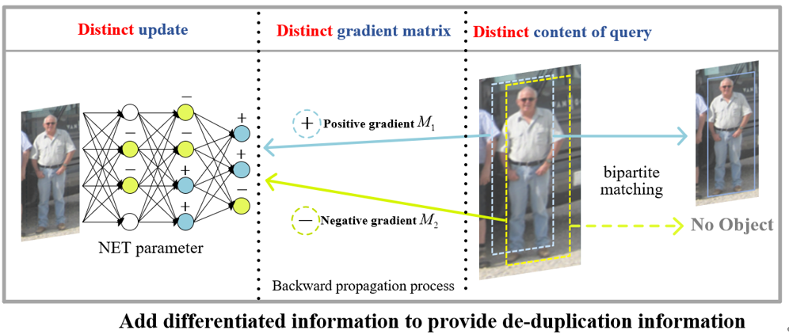
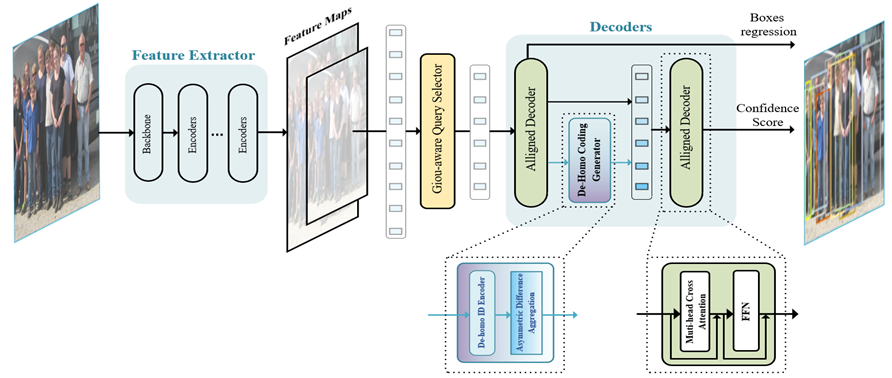

## DH-DETR: Dense Object Detection Based on Dehomogenised Queries


## Introduction
Dense object detection is widely used in automatic driving, video surveillance and other fields.
This paper focuses on the challenging task of dense object detection. 
Currently, detection methods based on greedy algorithms such as Non-Maximum Suppression (NMS) often produce many
repetitive predictions or missed detections in dense scenarios, a common problem faced by NMS-based algorithms.
Although the end-to-end DETR (DEtection TRansformer) type of detectors can incorporate the post-processing
de-duplication capability of NMS etc. into the network, we find that the homogeneous queries in the Query-based
detector lead to the reduction of the de-duplication capability of the network and the learning efficiency of the encoder,
resulting in duplicate prediction and missed detection problems. To solve this problem, 
we propose a learnable differentiated encoding to dehomogenise the queries, and at the same time, 
queries can communicate with each other by differentiated encoding information, 
replacing the previous self-attention among the queries. In addition,
we use a joint loss on the output of the encoder that considers both location and confidence prediction
to give a higher quality initialization for queries. Without cumbersome decoder stacking and guaranteeing accuracy, 
Our proposed end-to-end detection framework is more concise and reduces the number of parameters by about 8% compared
to deformable DETR. Our method achieved excellent results on the challenging [CrowdHuman]() dataset: 93.6% average precision 
(AP), 39.2% MR-2, and 84.3% JI. The performance overperformed previous SOTA methods, 
such as Iter-E2EDet (Progressive End-to-End Object Detection) and 
MIP (One proposal, multiple predictions). In addition, our method is more robust 
in various scenarios with different densities.


[//]: # (### Links)

[//]: # (- Iter Sparse R-CNN [[repo]&#40;https://github.com/megvii-research/Iter-E2EDET&#41;])


## Models

Experiments of different methods were conducted on CrowdHuman. All approaches take R-50 as the backbone.
Method | #queries | AP | MR | JI | Param
:--- |:---:|:---:|:---:|:---:|:---:
CrowdDet  | -- | 90.7 | 41.4 | 82.4
Sparse RCNN | 500 | 90.7 | 44.7 | 81.4 |
Deformable DETR | 1000 | 91.3 | 43.8 | 83.3 | 37.7M
Iter-E2EDet | 1000 | 92.1 | 41.5 | 84.0 | 38.0M
Deformable DETR + Ours (6-3) | 1000 | **93.6** | **39.2** | **84.3**  | 34.6M
Deformable DETR + Ours (6-3(2)))| 1000 | 93.5 | 39.3 | 84.1 | 33.7M

X-Y (Z) represents training with X Encoder and Y Decoder , and testing with Z decoders. other methods default to 6-6

## Installation
The codebases are built on top of [Deformable-DETR](https://github.com/fundamentalvision/Deformable-DETR)


#### Steps
1. Install and build libs following [Deformable-DETR](https://github.com/fundamentalvision/Deformable-DETR).
```bash
pip install -r requirements.txt
sh lib/ops/make.sh
```

2. Load the CrowdHuman images from [here](https://www.crowdhuman.org/download.html) and its annotations from [here](https://drive.google.com/file/d/11TKQWUNDf63FbjLHU9iEASm2nE7exgF8/view?usp=sharing). Then update the directory path of the CrowdHuman dataset in the config.py.

3. Train Iter Deformable-DETR
```bash
bash exps/aps.sh
```
or for Swin-L backbone:
```bash
wget https://github.com/SwinTransformer/storage/releases/download/v1.0.0/swin_large_patch4_window7_224_22k.pth
bash exps/aps_swinl.sh
```

4. Evaluate Iter Deformable-DETR. You can download the pre-trained model from [here](https://pan.baidu.com/s/1kwa_f7h8PUTe1lT4c39ODA?pwd=1111 
) (Baidu Driver) or [here]( https://drive.google.com/file/d/1K10_FQIEKad-uQjd0m6BUHOoHdarltfc/view?usp=drive_link)(Google Driver) for direct evaluation. 
```bash
bash exps/aps_test.sh 

